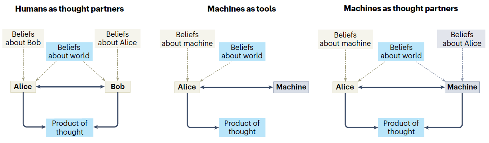
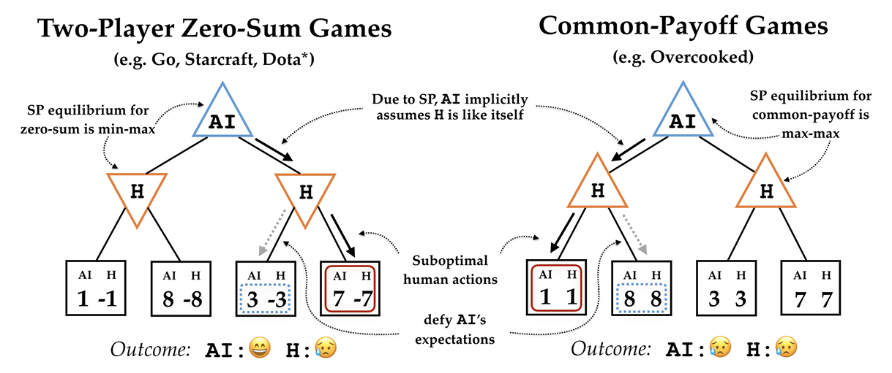
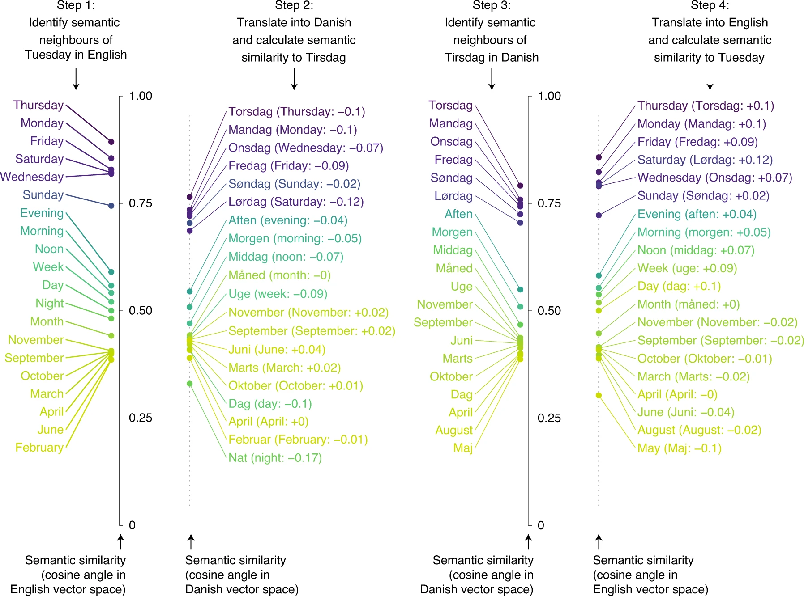
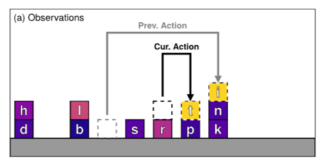

Across domains as different as structural engineering, jazz improvisation, and chess, expertise appears to involve more than an expanded store of facts: experienced practitioners seem to hold a qualitatively restructured representation of their problem space, and **to arrive at it in discrete jumps rather than gradual accumulation**. This pattern first became visible to me in a dataset of human and reinforcement-learning performance on Hexxed, a puzzle game structurally equivalent to a Markov Decision Process, where a deep Q-network improved continuously while human players plateaued and then "leapt," often skipping directly to near-optimal strategies.

This working paper proposes a two-level framework to explain that gap: experts maintain stable, high-confidence *world-level* beliefs about how their domain works alongside fast-updating, situation-specific *interaction-level* models, with expert performance emerging from the coordination between the two rather than either alone. World-level beliefs are themselves hierarchical, built by compressing individual episodic experiences into transferable higher-order concepts — a process with parallels to Bayesian program learning and representational-change accounts of insight.

The central claim is that **the human–AI gap may be less about architecture or scale than about what is optimized for**: instance-level prediction accuracy versus concept-level restructuring. AI systems — whether large language models predicting the next token or RL agents estimating state values — optimize for accurate prediction at the instance level, and any representational structure that emerges is a byproduct of that pressure rather than the target. Humans appear to optimize at the concept level instead, treating instance-level accuracy as a consequence of having the right concepts rather than the objective itself.

This is a living literature synthesis spanning cognitive science, machine learning, neuroscience, and linguistics that I'm continuing to develop as I read further. It closes with the open question I'm currently working through: what determines whether a new piece of information triggers conceptual reorganization, versus incremental updating within an existing frame.

## Sources I'm drawing from

**Core framework**

- Ohlsson, S. — representational change theory (impasse and restructuring in insight)
- Danek, A., et al. — behavioral characterization of the "Aha moment"
- Lake, B. M., Ullman, T. D., Tenenbaum, J. B., & Gershman, S. J. (2017). "Building Machines that Learn and Think Like People." *Behavioral and Brain Sciences*, 40:e253.
- Lake, B. M., Salakhutdinov, R., & Tenenbaum, J. B. — Bayesian Program Learning on the Omniglot dataset (one-shot concept generalization via compositional primitives)

Machines as thought partners, extending the machines-as-tools paradigm (Collins et al., 2024)

AI's expected payoff in competitive versus cooperative games — self-play assumptions break down when the human partner isn't optimal (Carroll et al., 2019)

**Human–AI thought partnership**

- Collins, K. M., Sucholutsky, I., Bhatt, U., Chandra, K., Wong, L., Lee, M., Zhang, C. E., Zhi-Xuan, T., Ho, M., Mansinghka, V., et al. (2024). "Building Machines that Learn and Think with People." *Nature Human Behaviour*, 8(10):1851–1863.
- Collins, K. M., Wong, L., Tenenbaum, J. B., & Fan, J. E. — "Meaningful Long-Term Thought Partnerships of Minds and Machines"
- Carroll, M., Shah, R., Ho, M. K., Griffiths, T., Seshia, S., Abbeel, P., & Dragan, A. (2019). "On the Utility of Learning about Humans for Human-AI Coordination." *Advances in Neural Information Processing Systems*, 32.
- Sucholutsky, I., Collins, K. M., Jacoby, N., Thompson, B. D., & Hawkins, R. D. (2025). "Using LLMs to Advance the Cognitive Science of Collectives."
- Wu, S. A., Wang, R. E., Evans, J. A., Tenenbaum, J. B., Parkes, D. C., & Kleiman-Weiner, M. (2021). "Too Many Cooks: Bayesian Inference for Coordinating Multi-Agent Collaboration." *Topics in Cognitive Science*, 13(2):414–432.

How semantic alignment is computed across languages (Thompson et al., 2020)

The "Block Words" game, used to study open-ended goal inference from partial evidence (Zhi-Xuan et al., 2024)

**Human cognition & inference**

- Thompson, B., Roberts, S. G., & Lupyan, G. (2020). "Cultural Influences on Word Meanings Revealed through Large-Scale Semantic Alignment." *Nature Human Behaviour*, 4(10):1029–1038.
- McGann, J. P. (2017). "Poor Human Olfaction is a 19th-Century Myth." *Science*, 356(6338):eaam7263.
- Friedman, Y., Ghavami, M., Bowers, M. L., Bolton, A. D., Siegel, M., Mansinghka, V., & Tenenbaum, J. B. (2025). "Tracking Uncertainty during Uncertain Tracking." *Proceedings of the Annual Meeting of the Cognitive Science Society*, 47.
- Zhi-Xuan, T., Kang, G., Mansinghka, V., & Tenenbaum, J. B. (2024). "Infinite Ends from Finite Samples: Open-Ended Goal Inference as Top-Down Bayesian Filtering of Bottom-Up Proposals." arXiv:2407.16770.
- Baker, C. L., Saxe, R., & Tenenbaum, J. B. (2009). "Action Understanding as Inverse Planning." *Cognition*, 113(3):329–349.
- Jara-Ettinger, J., Schulz, L. E., & Tenenbaum, J. B. (2020). "The Naive Utility Calculus as a Unified, Quantitative Framework for Action Understanding." *Cognitive Psychology*, 123:101334.

**Communication & coordination**

- Frank, M. C., & Goodman, N. D. (2012). "Predicting Pragmatic Reasoning in Language Games." *Science*, 336(6084):998.
- Hawkins, R. D., Franke, M., Frank, M. C., Goldberg, A. E., Smith, K., Griffiths, T. L., & Goodman, N. D. (2023). "From Partners to Populations: A Hierarchical Bayesian Account of Coordination and Convention." *Psychological Review*, 130(4):977.
- Tessler, M. H., et al. (2024). "AI Can Help Humans Find Common Ground in Democratic Deliberation." *Science*, 386(6719):eadq2852.
- Shiiku, S., Marjieh, R., Anglada-Tort, M., & Jacoby, N. (2025). "The Dynamics of Collective Creativity in Human-AI Hybrid Societies." *Proceedings of the Annual Meeting of the Cognitive Science Society*, 47.

**Neuro-symbolic AI & experimental design**

- Bridgwater, A. (2026). "Why We Need Neuro-Symbolic AI." *Forbes*.
- Ying, L., Collins, K. M., Sharma, P., Colas, C., Zhao, K. I., Weller, A., Tavares, Z., Isola, P., Gershman, S. J., Andreas, J. D., et al. (2025). "Assessing Adaptive World Models in Machines with Novel Games." arXiv:2507.12821.
